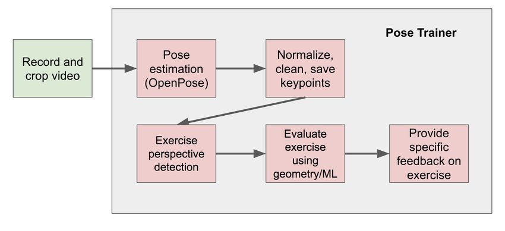

# My Life - Personal Lifestyle Monitoring System

- [1. Inception Phase](#1-inception-phase)
  - [1.1. Context](#11-context)
  - [1.2. Problem](#12-problem)
  - [1.3. Personas](#13-personas)
  - [1.4. Goal](#14-goal)
  - [1.5. Task List](#15-task-list)
  - [1.6. Expected Results](#16-expected-results)
  - [1.7. Key system functionalities](#17-key-system-functionalities)
  - [1.8. Related work](#18-related-work)
  - [1.9. Communication Plan](#19-communication-plan)
  - [1.10. Team Roles](#110-team-roles)
  - [1.11. Project calendar](#111-project-calendar)
- [2. Elaboration Phase](#2-elaboration-phase)
  - [2.1. Requirements gathering](#21-requirements-gathering)
  - [2.2. Context and State of The Art (SOA)](#22-context-and-state-of-the-art--soa-)
    - [2.2.1. Context](#221-context)
    - [2.2.2. State of The Art and Related Work](#222-state-of-the-art-and-related-work)
      - [Food Recognition and Classification](#food-recognition-and-classification)
      - [Workout Recognition and Correction](#workout-recognition-and-correction)
  - [2.3. Actors](#23-actors)
  - [2.4. Use Cases](#24-use-cases)
    - [2.4.1. Web Application Patient [Tom1k]](#241-web-application-patient--tom1k-)
    - [2.4.2. Web Application Doctor [Tom1k]](#242-web-application-doctor--tom1k-)
    - [2.4.3. Web Application Admin [Mendes]](#243-web-application-admin--mendes-)
    - [2.4.4. Mobile Application [Mendes]](#244-mobile-application--mendes-)
  - [2.5. Functional requirements](#25-functional-requirements)
  - [2.6. Non-functional requirements](#26-non-functional-requirements)
  - [2.7. System Architecture](#27-system-architecture)
    - [2.7.1. Technological Architecture Diagram](#271-technological-architecture-diagram)
    - [2.7.2. Deployment Diagram](#272-deployment-diagram)
  - [2.8. Domain Model](#28-domain-model)
  - [2.9. User Interaction](#29-user-interaction)

## 1. Inception Phase

### 1.1. Context

The use of information and communication technologies in the health area is being explored in the most diverse scenarios of diagnosis and treatment of patients.

In the last decade, there has been a proliferation of mobile devices for monitoring vital signs and physical activity of citizens, thus enhancing the emergence of a new paradigm for monitoring clinical conditions and behavioural habits.

On the other hand, it is known that patterns of food consumption have a major impact on health conditions and that more and more citizens are concerned with monitoring their diet, recording the calories and macronutrients they consume and also the calories they spend on physical exercise.

### 1.2. Problem

Due to the growing demand of the labour market, the day-to-day tasks that increasingly fill citizens' schedules and other activities that make up daily life, people have less and less time to monitor their health and perform activities to promote a good lifestyle.

Various technologies on the market try to assist people in this area by providing tools where it is possible to insert the foods consumed daily, but manual insertion is still time-consuming and takes up a large amount of time.

Gymnasiums and personal trainers try to instil a culture of exercise and a healthy lifestyle in citizens, but the prices and the high number of people who frequent this space end up discouraging many citizens from practising a healthy lifestyle.

### 1.3. Personas

- **Doctor**

  António Silva, 35 years old, born in Ovar, Aveiro, lives in Porto where he currently works as a doctor in Hospital de São João.

  António feels the need to have more information about his patients daily food routine, workout routine, clinical context and other metrics, but he feels that the 5 to 10 min medical appointments aren't enough to gather all this information.

  António feels that with an easy-to-use application, where he can access all daily-life details of his patients, he could have more productive appointments and pay more attention to his patients.

- **Patient**

  Francisca Barros, 25 years old, born in Águeda, Aveiro, lives in Porto where she works as a Test Engineer in Blip.

  Francisca cares about her health, so she tries to have a healthy life, keeping track of her daily food intake and a balanced weekly workout routine. She also likes technology and uses a bunch of high-end gadgets to help her track health metrics like heart rate and steps taken in a day.

  Unfortunately, giving her tight schedule related to work, she doesn't always have the time to track her daily food consumption or track if she is complying to her workout plan and correctly doing the exercises.

  Therefore, Francisca feels that with an easy-to-use system, that enables her to track her food consumption in an easy and fast way and also helps her make sure she is complying with her workout schedule and correctly executing the exercises, she could have a healthier lifestyle and follow her workout plan more rigorously.

### 1.4. Goal

This project aims to provide an intuitive and effective way to monitor a person's diet and further assist them in the practice of physical exercise, correcting the user when necessary.

With this objective in mind, we intend to develop a web information system that allows the integrated collection and visualization of clinical data sources, physical activity and eating habits related to a citizen's daily life.

The solution should proceed to the automatic collection of different types of data, such as vital signs, regular motor activity, specific physical exercises and ingested food.

On the other hand, the application should allow simplified registration of basic physical and mental health conditions of the person, such as pain in the organ or limb, depression, anxiety, fatigue, etc.

### 1.5. Task List

**Module: OpenPose (Tiago Mendes, João Vasconcelos and Tomás Costa)**

- **Task 1:** Investigate and learn how to use the software [Tiago Mendes, João Vasconcelos and Tomás Costa]
- **Task 2:** Implement a simpler use case of OpenPose [Tiago Mendes, Tomás Costa]

**Module: Computer Vision (ML Food Recognition) (João Vasconcelos, Vasco Ramos, Tomás Costa and João Marques)**

- **Task 1:** Search and analyse for machine learning and pattern recognition tools [João Vasconcelos, Vasco Ramos and Tomás Costa]
- **Task 2:** Search for a dataset of foods and respective properties (protein, calories, carbohydrates) [Tomás Costa]
- **Task 3:** Implement a first (simple) version of the food recognition algorithm [Vasco Ramos and João Marques]

**Module: Service Broker (To connect sensors to our system) (Tiago Mendes and João Marques)**

- **Task 1:** Search viability of using Kafka vs RabbitMQ [João Marques and Tiago Mendes]
- **Task 2:** Implement the first version of communication [João Marques]
- **Task 3:** Investigate how to connect and retrieve information of FitBit Band [Tiago Mendes]

**Module: Backend (João Vasconcelos, João Marques and Vasco Ramos)**

- **Task 1:** Define what database to use for each scenario [Vasco Ramos and João Vasconcelos]
- **Sub-module: Sensor logic**
  - **Task 1:** Create the database schema [João Marques and Vasco Ramos]
  - **Task 2:** Define the endpoints necessary to the API [João Marques and Vasco Ramos]
- **Sub-module: Operation logic**
  - **Task 1:** Create the database schema [João Vasconcelos]
  - **Task 2:** Define the endpoints necessary to the API [João Vasconelos and Vasco Ramos]

**Module: Frontend (Tiago Mendes and Tomás Costa)**

- **Task 1:** Creation of static homepage with minimum information and details of the project [Tiago Mendes e Tomás Costa]
- **Task 2:** Design and develop an interface for the mobile application [Tiago Mendes e Tomás Costa]
- **Task 3:** Design and develop an interface for the web applications [Tiago Mendes e Tomás Costa]

**Module: CI/CD Pipeline (João Marques and Vasco Ramos)**

- **Task 1:** CI Pipeline [Vasco Ramos and João Marques]
- **Task 2:** CD Pipeline [João Marques]

### 1.6. Expected Results

At the end of this project, we expect to have a fully functional application capable of tracking eating habits and physical activity of an individual.

This product will be capable of connecting with fitness trackers (Fitbit Charge 3) and other instruments that will measure data such as the number of steps walked, heart rate, quality of sleep, steps climbed, and other personal metrics involved in fitness.

The user will have the opportunity to track calories, macronutrients and other metrics. By taking a picture of the food, the app will automatically log the calories, proteins, carbohydrates and other metrics for future review by the user.

The application will be capable of recording workout plans and give you feedback about your performance and posture at the end of the training.

Besides that our users will be connected to a doctor that will have access to all the food and workout history of the patient so he can give more precise feedback.

### 1.7. Key system functionalities

- Tracking of calories, macronutrients and other food metrics through computer vision, enabled by a photo taken by the user.
- Connection with fitness monitoring systems for more accurate health metrics (like Fitbit Band)
- Movement analysis (OpenPose) for controlling and correcting physical exercises done by the user.

### 1.8. Related work

The following systems, technologies and applications are interesting within the context of our project:

- **Freeletics:** [https://www.freeletics.com/pt/](https://www.freeletics.com/pt/)
- **BiteAI:** [https://bite.ai/](https://bite.ai/)
- **MyFitnessPal:** [https://www.myfitnesspal.com/](https://www.myfitnesspal.com/)
- **OpenPose:** [https://github.com/CMU-Perceptual-Computing-Lab/openpose](https://github.com/CMU-Perceptual-Computing-Lab/openpose)
- **Snap IT:** [https://www.loseit.com/snapit/](https://www.loseit.com/snapit/)

### 1.9. Communication Plan

- **Backlog Management:** For backlog management we are using [Jira](https://my-life.atlassian.net/secure/RapidBoard.jspa?rapidView=1) (an issue tracker and agile project management application) since it is a widely used tool and provides great project tracking for teams, it ranks number one for software project management tools with requirement tracking, task tracking and version tracking.

- **Git Platform:** For the Git platform, we chose [GitLab](https://gitlab.com/_mylife/mylife) since it has easier CI/CD Integration and several others tools we find useful, as opposed to GitHub.

  - Git Standards:
    - For each new feature create a new branch.
    - For each fix create a new branch
    - Never merge directly, always make pull requests and identify at least one person to check (review) that pull request before merging the PR.
    - **New feature branch:** For each new feature create a branch following the standard: `feature/<feature_name>`.
    - **New Issue branch:** For each fix create a branch following the standard: `hotfix/<fix-name`.

- **Team Communication:** For intra-team communication we are using Slack, since every member is familiarized with the tool and, we have integrated it with Gitlab for continuous updates on our repository. We are also using a Matrix/Riot bridge (an Open-Source alternative) so we can access the premium features of Slack (not losing messages for example).

### 1.10. Team Roles

- **Product Owner:** [João Vasconcelos](https://jmnmv12.github.io/AboutMePT)
- **DevOps Master:** [João Marques](https://jmarques.icu/)
- **Architect:** [Tiago Mendes](htytps://github.com/tiagocmendes)
- **Lead Developer:** [Tomás Costa](https://github.com/TomasCostaK)
- **Project Manager:** [Vasco Ramos](https://vascoalramos.me)
- **Advisor:** [Carlos Costa](http://sweet.ua.pt/carlos.costa/)

### 1.11. Project calendar

This is our project calendar, divided by milestones and their respective durations.
For a more detailed explanation about this calendar, [click here](./calendar/README.md).

## 2. Elaboration Phase

### 2.1. Requirements gathering

To fully address the problems in real life we need to solve, we should conduct several **studies**, **analysis** and **interviews** to get an idea of the actual usage our platform aims to have.

With that objective in mind, our process of requirements gathering can be divided into **3 distinct parts**.

In the **first part**, we discussed different ideas through **brainstorms** to decide what will be the **system boundaries**, **objectives** and **users**.

**The next part** was a research about the **current state of the art** in the area of health, exercise and food tracking where we analyzed different papers, projects, studies and technologies. This investigation improved a lot our requirements because it allowed us to understand what has been done, what has worked in the area and what has not worked.

**The final part**, and probably the most important one, were the talks with our advisor, Carlos Costa. His experience in information systems in the medical area was essential to do decide what we should include and not include in our final product. Interviews with both doctors and potential users would be of help, but because the available time for this phase was short they were not possible. We are going to present an overview of the discussed topics with our advisor:

- **The recognition of food images** can be a tricky part of our system, especially when we stack different ingredients and the food is mixed. For that reason, he told us to focus first on the recognition of food that is separated and that we can differentiate from one another.

- **The recognition of physical exercises** is a secondary part of our product and it's a very complex activity. For those reasons, we were advised to first focus on identifying a single exercise and scale to other exercises when the first one is perfected.

- Diabetes is one of the most common diseases nowadays, affecting a big chunk of the world population. Because of that reason we had the idea of **integrating diabetes monitoring systems** in our product besides the Fitbit monitoring watch. We decided not to advance with this idea because we want to focus on integrating our system with the Fitbit monitoring system perfectly.

Given all these insights and after weighting the **pros** and **cons**, the following decisions were made. The devices to be integrated with the system would be the Fitbit smartwatch because it's a commercial device accessible to the general public and at the same time it can give important information to the user and the doctor associated to that user like blood pressure, heart rate and other metrics.

To access the system, it was decided to build a **web application** so that medics could access it, at any time. The general user will also have access to a **web application** but the **main platform** will be the **mobile application** capable of taking photos to the food and of recording the user's workout. Besides that we also decided to build a **web application** only available to the administrators where they can visualize important metrics about the product and add new doctors to the ecosystem.

### 2.2. Context and State of The Art (SOA)

#### 2.2.1. Context

In this subsection, it's presented a description of how the system is expected to be used by the different stakeholders.

To begin with, an **Administrator** (someone in charge of the system administration) should register/unregister doctors in the system. This will be an occasional operation taking no longer than a couple of minutes. It also has access to some charts and statistics regarding the system.

Once a **Doctor** is registered in the system and understood it well, in the situation of an appointment with a **Patient**, that can benefit from the monitoring system, he presents it to the patient. If the patient is already enrolled in the system as a normal user, the doctor can add the patient (regular user) as one of its patients. If the patient is not yet enrolled and is willing to use the system, he can register himself on the web/mobile application (this can also be done by his doctor, if the patient prefers it).

The **Patient / Regular User** can use the web application and/or mobile app to keep track of food consumptions and metrics regarding calories and, possibly, macronutrients. To do this, it needs to be previously logged in the system and take photos of the food it consumes. The user will also have the possibility to integrate this tracking with other devices like a smart band (e.g: [Fitbit Charge 3](https://www.fitbit.com/eu/charge3)). At last, if the user wants to see some metrics about his health and food/liquids consumption, he can use the statistics page to access this information.

It is also worth noting that the Regular User **can** use our system without requiring any association with a doctor.

#### 2.2.2. State of The Art and Related Work

##### Food Recognition and Classification

The [work](https://ieeexplore.ieee.org/document/8228338) of David J. Attokaren _et. al_ presents an implementation of Convolutional Neural Networks to execute Food Classification from images. The Dataset used was Food-101 which contains 101 000 images and 101 categories. It was also used a model from Google: **Google Inception V3**. They used that Food-101 dataset to train the model and the ImageNet one to test the system. Bellow, we have a table comparing results to their approach to other already known models.

From what we found there are already two successful products ([Bite AI](https://bite.ai/) and [Snap IT](https://www.loseit.com/snapit/)) that undertake a similar purpose in the form of a Rest API. These two services are a reference point to what we want to do.

##### Workout Recognition and Correction

In the [paper](https://www.researchgate.net/publication/324759769_Pose_Trainer_Correcting_Exercise_Posture_using_Pose_Estimation) produce by Steven Chen and Richard Yang is presented a tool produced by them _Pose Trainer_: an application that detects the user’s exercise pose
and provides personalized, detailed recommendations on how the user can improve their form.

For the pose estimation, it was used pre-trained real-time system, [OpenPose](https://github.com/CMU-Perceptual-Computing-Lab/openpose), that can detect human body keypoints in videos.

For the posture evaluation (pose training) component,
they have recorded videos of themselves performing exercises. These videos include correctly performed exercise examples, as well as intentionally incorrect ones.

Bellow, is presented a diagram representative of the pipeline flow of _Pose Trainer_:

For pose estimation, we use deep convolutional neural networks (CNNs) to label RGB images. After experimentation with multiple state-of-the-art pose estimators, they choose to use the pre-trained model, OpenPose, for pose detection.

The results were considered by the authors satisfying and the following table shows an overview of the metrics used to evaluate the results.

### 2.3. Actors

Firstly, the target user for the mobile application is any regular person who is interested in monitoring their lifestyle and knows how to interact with a smartphone, even though it is recommended that this person is at least a teenager. This type of users can also access the web application, that is similar compared to the mobile application.

Secondly, we will also have another web application to be used by doctors, to view and analyze specific details about the health habits of patience before an appointment with him. Thereby, this appointment will be more productive and fast. If needed, we can also convert the web application into a desktop application for Windows, Mac or Linux.

Finally, the administrators of all the applications (in this case, our development team) will have a simple admin web dashboard with a variety of information and details about the two types of users described above. Although it is not strictly necessary to have this third web application, it will be a helpful mean to manage our entire information system.

To sum up, the main actors of our system are described in the following list:

- **Patient (regular person):** User with access to both a mobile application and web application (represents the majority of users of the system). This access allows him to store meal consumption (by taking photos) and its nutrients information and also view his historical information and statistics.

- **Doctor:** This actor will have access to a web application (or desktop application) with the information provided by the patient's applications.

- **Administrators:** This actor is the one with most authority on the system: it's allowed to add new doctors and remove existing ones, managing the access of doctors to the system. It also has a simple web admin dashboard, with information and statistics about platform usage and interaction.

### 2.4. Use Cases

#### 2.4.1. Use Cases model  

In order to understand how our actors will interact with our system, first we must define what are the use cases related to those interactions. The following diagram shows what interfaces our actors will use:

  

#### 2.4.2. Mobile Application

| Number | Use case | Brief description | Priority |
|--------|----------|-------------------|----------|
| 1 | Insert food log (Picture or manual) | Francisca wants to insert a new food log. First, she creates a new one. The food log must have a title, a little description, a timestamp and a type of meal (breakfast, lunch or dinner). Then, Francisca must take a picture of the food she wants to eat and save it in the food log. After some time of processing, she will see the nutritional information about the food and the recommendations of our system. | High |
| 2 | Record practice | Francisca wants to start a new training session. For that, she checks her daily training and starts it. For each recommended exercise, Francisca can start recording it, placing the smartphone on top of a support. After she finishes each exercise, she saves the video and wait for the results. | High |
| 3 | Check health measures | Francisca wants to check her health measures. In the main page of the mobile application, she can click on the respective button and watch some nutrional and physical data like burnt calories, heart beat rate, sleep quality and much more. She will also check her global health status. | High |
| 4 | Create a training plan | If Francisca wants to create a new training plan, first she needs to open the main page of the mobile app and click on the respective button. In order to create this new training plan, Francisca must choose in what days of the week she wants to train and choose which types of exercises she is interested. She can also choose the recommend training plan by our system. | Medium |
| 5 | Check his training plans| With our application, Francisca can check his past, current and future training plans, and edit or delete them if needed. She will also receive an alert when it's time to train! | Medium |
| 6 | Create a nutritional plan | Similar to the creation of a training plan, Francisca can create a nutritional plan. For that, she needs to choose this option and define a set of recommended meals for a specific period. She can also see nutritional information about this meals, and edit them if necessary. | Medium |
| 7 | Check his nutritional plans| Francisca can see all her nutritional plans history, and also confirm what she will eat for the next days. If needed, she can also edit or remove a meal from her nutritional plan. | Medium |
| 8 | Communicate with the doctor | Francisca can communicate with her doctor through chating. She can also schedule appointments and check when her next appointment will take place. | Low |
| 9 | Check doctor's reports | After an appointment, Francisca can watch or download the doctor's report, and comment it. She can also see past reports, and compare them between sessions. | Low |

#### 2.4.3. Web Application Patient

| Number | Use case | Brief description | Priority |
|--------|----------|-------------------|----------|
| 1 | Check health measures | Similiar to the feature in the mobile app, Francisca can check her health measures on the web application. For that, in the main dashboard of her account, she just need to choose this option and watch some important metric about heart beat rate, sleep quality, burnt calories, kilometers walked and much more. She can also check her global health measures. | High |
| 2 | Create a training plan | If Francisca wants to create a new training plan, first she needs to open the main page of the web application and click on the respective button. In order to create this new training plan, Francisca must choose in what days of the week she wants to train and choose which types of exercises she is interested. She can also choose the recommend training plan by our system. | Medium |
| 3 | Check his training plans | With our application, Francisca can check his past, current and future training plans, and edit or delete them if needed. She will also receive an alert when it's time to train! | Medium |
| 4 | Create a nutritional plan |  Similar to the creation of a training plan, Francisca can create a nutritional plan. For that, she needs to choose this option and define a set of recommended meals for a specific period. She can also see nutritional information about this meals, and edit them if necessary. | Medium |
| 5 | Check his nutritional plans| Francisca can see all her nutritional plans history, and also confirm what she will eat for the next days. If needed, she can also edit or remove a meal from her nutritional plan. | Medium |
| 6 | Communicate with the doctor | Francisca can communicate with her doctor through chating. She can also schedule appointments and check when her next appointment will take place. | Low |
| 7 | Check doctor's reports | After an appointment, Francisca can watch or download the doctor's report, and comment it. She can also see past reports, and compare them between sessions. | Low |

#### 2.4.4. Web Application Doctor

| Number | Use case | Brief description | Priority |
|--------|----------|-------------------|----------|
| 1 | Check patients health measures | Brief description | High |
| 2 | Manage patients nutritional plans | Brief description | High |
| 3 | Manage patients training plans | Brief description | High |
| 4 | Manage patients | Brief description | High |
| 5 | View patients food logs | Brief description | Medium |
| 6 | View patients training logs | Brief description | Medium |
| 7 | Produce a report | Brief description | Low |
| 8 | Receive urgent notifications | Brief description | Low |

#### 2.4.5. Web Application Admin

| Number | Use case | Brief description | Priority |
|--------|----------|-------------------|----------|
| 1 | Check data analytics | Brief description | High |
| 2 | Manage doctors | Brief description | High |
| 3 | Manage system components | Brief description | Low |

### 2.5. Functional requirements

1. **Business Rules**:
   1. Separation between **Regular Users**, **Doctors** and **Administrators** (see [Actors](#24-actors)), both in _buisiness logic_ and in client applications.
   2. Seamless and intuitive connection between all the business roles.
2. **Administrative Functions**:
   1. As explained in [Actors](#24-actors), we plan to have an **Administrator** role.
   2. The **Doctor** also play an "administrative" role in the _business logic_.
3. **Authentication and Authorization levels**:
   1. Doctors and Administrators **must** be logged in.
   2. Regular users **should** login to have the best experience (start with the assumption that everyone will log in).
   3. Implement integration with external login services (Google OAuth).
4. **Reporting**:
   1. The system should automatically report errors and crashes to the development team.
   2. Users should be able to report problems themselves (possibly start with issues on GitHub/GitLab)
5. **Historical Data**:
   1. (Possibly) Support integration with legacy services.
6. **Regulatory Requirements**:

Concerning the use cases enumerated above:

1. The data generated from the user (exercise, food, ...) should be able to be accessed through a platform -> Data from the sensors should be available on the web client and mobile app.
2. The user should have a platform in which he can create and design a health plan -> Web client should have a plan design platform.
3. A chat application for communication between doctor and patient. It should also allow urgent notifications.
4. Communication between patient data a doctor, through database and business logic.
5. Interface for a doctor to search user in the system and add them to his patient list.
6. Admin page to view analytics (possibly use Django admin), add users and connections between them.
7. Photograph food to get data on the mobile app. 
8. Insert food data on web/mobile app.
9. Record exercise and measure if it has been done correctly.

### 2.6. Non-functional requirements

We want our system to assure performance, availability, recoverability, maintainability, security, data integrity, usability, or interoperability.

Therefore, our goal is to make use of industry standards in **database systems**, **container orchestration**, **distribution**, **replication**, etc.

The use of standard and known technologies will help us maintain the quality of our product.

### 2.7. System Architecture

#### 2.7.1. Technological Architecture Diagram

To understand how our system will work as a whole, we defined the following technological architecture, that shows how the different layers and the components inside them are linking together. We will also show what are the technologies and tools that will help us develop our information system.

For a more detailed explanation about this diagram, [click here](./architecture/README.md).

#### 2.7.2. Deployment Diagram

Our information system will be made of several distinct components, each one of them running in a different machine. In this sense, the following deployment diagram aims to show how these components will be deployed and connected, communicating between them.

### 2.8. Domain Model

### 2.9. User Interaction
