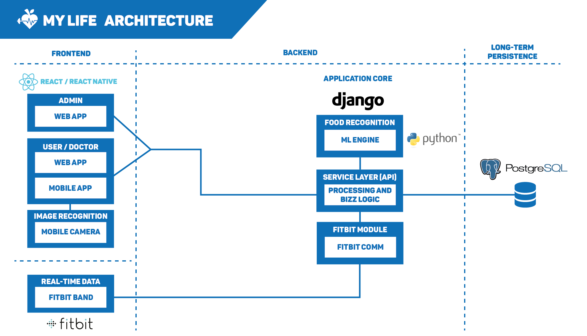

# My Life Architecture

## 1. Architecture

My Life monitoring system should be a complete information system, from the users interfaces up to the backend and persistence layers. Therefore, our team thought about a potencial architecture for this complex system, as illustrated in the next figure.

## 2. Technologies

### 2.1. Frontend

#### 2.1.1. Web applications  

For both the **user/doctor and admin web applications** we are going to use [ReactJS](https://reactjs.org/), a JavaScript library for building user interfaces. The main benefits of using ReactJS is due to it's vast library of templates and pre-fabricated elements, ease of use and ability to create reactive and graphical elements on-the-go.

It also offers:

* A single component  
* A stateful component  
* An application  
* A component using external plugins  

#### 2.1.2. Mobile applications

For both the **user/doctor and admin web applications** we are going to use [React Native](https://facebook.github.io/react-native/) because we wanted to guarantee there is portability between our web applications and our mobile application. The main benefits of using React Native are the same as described above for **ReactJS** and also the ability of creating native apps for Android and iOS.

### 2.2. Real-time data

In order to monitor a particular user lifestyle in real-time, we are going to use the [Fitbit band](https://www.fitbit.com/). This band has the following functionalities:

* Know your heart with PurePulse.
* Magically measure exercise with SmartTrack.
* Shed light on your night with sleep tracking.
* GPS signal.  

### 2.3. Backend  

#### 2.3.1. Proxy  

In order to balance the load of our distributed system, we are going to use a **proxy** with the [Elastic Load Balancer](https://aws.amazon.com/elasticloadbalancing/) on it. This solution has some major benefits like:  

* **Highly available:** Elastic Load Balancing automatically distributes incoming traffic across multiple targets
* **Secure:** Elastic Load Balancing works with Amazon Virtual Private Cloud (VPC) to provide robust security features, including integrated certificate management, user-authentication, and SSL/TLS decryption.  
* **Elastic:** Elastic Load Balancing is capable of handling rapid changes in network traffic patterns.  
* **Flexible:** Elastic Load Balancing also allows you to use IP addresses to route requests to application targets.  
* **Robust monitoring & auditing:** Elastic Load Balancing allows you to monitor your applications and their performance in real time with Amazon CloudWatch metrics, logging, and request tracing.  
* **Hybrid load balancing:** Elastic Load Balancing offers ability to load balance across AWS and on-premises resources using the same load balancer. 

#### 2.3.2. Data streams / Message Queues  

For the messages queues we are going to use [RabbitMQ](https://www.rabbitmq.com/) or [Kafka](https://kafka.apache.org/).  

**Kafka vs RabbitMQ:** Some differences about this two frameworks: [https://www.educative.io/edpresso/kafka-vs-rabbitmq](https://www.educative.io/edpresso/kafka-vs-rabbitmq)  

#### 2.3.3. System core  

For the core of our system at the backend, we are going to use [Django](https://www.djangoproject.com/) and [Django REST Framework](https://www.django-rest-framework.org/). 
**Django is a high-level Python Web framework** that encourages rapid development and clean, pragmatic design. Built by experienced developers, it takes care of much of the hassle of Web development, so you can focus on writing your app without needing to reinvent the wheel. It’s free and open source.  
Essentially, **Django REST Framework** is a powerful and flexible toolkit for building Web RESTful APIs.  

Some advantages of Django:

* **Fast:** This has been designed in a way to help the developers make an application as fast as possible.  
* **Fully Loaded:** It works in a way that includes dozens of extras to help with user authentication, site maps, content administration, RSS feeds and much more such things.  
* **Secure:** When you are doing it in Django, it is ensured that developers don’t commit any mistakes related to security. 
* **Scalable:** To meet the heaviest traffic demand, the benefits of Django framework can be seen.  
* **Versatile:** Content management, scientific computing platforms, and even big organizations, all these aspects are very efficiently managed by the use of Django.  

#### 2.3.4. Food recognition  

For the **food recognition module**, we obviously are going to use **Django and Python** to build a **machine learning engine from scratch**. If we need to use some machine learning framework, maybe we will consider [TensorFlow](https://www.tensorflow.org/) or [PyTorch](https://pytorch.org/).

#### 2.3.5. Cross-fit module  

In order to recognize cross-fit exercises with the camera of a smartphone, we are going to use [OpenPose](https://www.learnopencv.com/tag/openpose/) and [OpenCV](https://opencv.org/). The module logic will also be developed with Django.

### 2.4. Long-term persistence  

#### 2.4.1. Main relational database  

For the main database of our system, we are going to use the [PostgreSQL](https://www.postgresql.org/) relational database management system. Some benefits of this RDMS are:

* **Open Source DBMS**
* **Diverse Community**
* **Function**
* **ACID and Transaction**
* **Diverse indexing techniques**
* **Flexible Full-text search**
* **Diverse kinds of replication**
* **Diversified extension functions**

#### 2.4.2. Food images for recognition

In order to recognize different foods through images, we will store them locally on a folder, without using any database.  

#### 2.4.3. Real-time data 

In order to store real-time data and analytics about the **Fitbit band**, we are going to use the time series database [InfluxDB](https://www.influxdata.com/).  

